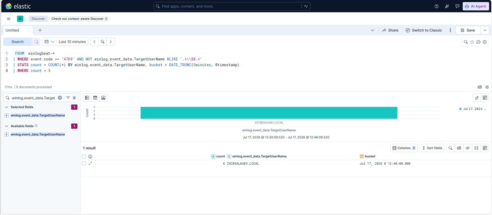

````markdown
# Kerberoasting Attack — AD Lab Report

**Lab:** salkaev.local (Windows Server AD Domain Controller + Windows 10 client)  
**Target account:** `svc_sql` (service account)  
**Tools used:** Active Directory Users and Computers, `setspn`, Rubeus 1.6.4 Elastic Security (ES|QL)

---

## Objective

Simulate a Kerberoasting attack against a service account in my home Active Directory lab, extract and crack the resulting TGS hash, and develop an Elastic ES|QL detection capable of identifying Kerberoasting activity.

---

## Background

Kerberoasting targets Active Directory service accounts that have a Service Principal Name (SPN) registered. Any authenticated domain user can request a Kerberos service ticket (TGS) for these accounts without requiring elevated privileges.

The returned ticket is encrypted using the service account's password hash. Once obtained, the ticket can be cracked completely offline without any further interaction with the target service, making Kerberoasting one of the most common Active Directory credential access techniques (MITRE ATT&CK T1558.003).

---

# Step 1 — Identify a Kerberoastable Account

Before requesting any Kerberos tickets, I verified which account in the domain had an SPN registered.

The `svc_sql` account contains the following Service Principal Name:

```
http/svc_sql.salkaev.local
```


The same information was confirmed using the built-in `setspn` utility.


**Why this matters**

In a real environment an attacker would typically enumerate SPNs using LDAP queries or PowerView rather than Active Directory Users and Computers. The graphical interface was used only to visually verify the lab configuration before beginning the attack.

---

# Step 2 — Request and Extract the TGS Hash

I used **Rubeus v1.6.4** to enumerate Kerberoastable accounts and request a Kerberos service ticket.

```powershell
Rubeus.exe kerberoast /domain:salkaev.local /dc:192.168.10.7
```


Rubeus successfully discovered the `svc_sql` account and extracted its TGS hash.


The output showed:

- **SamAccountName:** `svc_sql`
- **SPN:** `http/svc_sql.salkaev.local`
- **Encryption Type:** RC4_HMAC_DEFAULT (etype 23)

---

# Step 3 — Crack the Hash Offline

The extracted Kerberos hash was supplied to Hashcat using mode **19700**.

```powershell
hashcat.exe -m 19700 hash_clean.txt rockyou.txt
```

Hashcat successfully recovered the service account password.


This demonstrates that Kerberoasting enables offline password recovery without generating repeated authentication attempts or triggering account lockout mechanisms.

---

# Troubleshooting Notes

The attack itself worked immediately, but preparing the hash for Hashcat required several fixes.

The first hash file generated by Rubeus (`/outfile:`) contained a UTF-8 Byte Order Mark (BOM). Although the hash appeared correct in the console, Hashcat rejected it with errors such as:

- `Separator unmatched`
- `Token length exception`

Copying the hash manually through the PowerShell console introduced additional formatting issues because long lines wrapped across the terminal.

The solution was to extract only the hash line and save it explicitly without a BOM (`ASCII` / `utf8NoBOM`), verifying the file contents using `Format-Hex`.

**Takeaway:** when Hashcat rejects an apparently valid Kerberos hash, always verify the file encoding before assuming the hash itself is malformed.

---

# Result

The attack successfully demonstrated the complete Kerberoasting workflow:

- Identified a Kerberoastable service account.
- Requested a Kerberos service ticket.
- Extracted the TGS hash.
- Cracked the service account password offline using Hashcat.

---

# Detection in Elastic

After replaying the attack, I implemented an **ES|QL** detection rule that identifies an unusually high number of Kerberos Service Ticket requests (Windows Security Event ID **4769**) while filtering out machine accounts to reduce baseline authentication noise.

```sql
FROM winlogbeat-*
| WHERE event.code == "4769"
    AND NOT winlog.event_data.TargetUserName RLIKE ".*\\$@.*"
| STATS count = COUNT(*)
    BY winlog.event_data.TargetUserName,
       bucket = DATE_TRUNC(5minutes, @timestamp)
| WHERE count > 5
```

The detection successfully identified the Kerberoasting activity generated during the lab.



The query grouped Event ID **4769** records into five-minute windows and detected the account **ZXC@SALKAEV.LOCAL**, which generated **six Kerberos Service Ticket requests** within a single time bucket.

Since the configured threshold was **greater than five requests**, the activity was flagged as suspicious. Filtering out machine accounts (`$`) significantly reduced normal Kerberos authentication noise and improved the visibility of user-generated ticket requests.

Although intentionally simple, this ES|QL rule provides a practical proof of concept for detecting Kerberoasting activity within an Active Directory environment.

---

# Detection Recommendations

This detection can be further improved by incorporating additional indicators:

1. Alert on Event ID **4769** where the ticket encryption type is **RC4 (0x17)**, since modern environments should primarily use AES encryption.
2. Detect users requesting tickets for multiple different SPNs within a short period of time.
3. Build historical baselines for normal Kerberos ticket requests and alert on anomalous deviations.

---

# Environment

- **Domain:** `salkaev.local`
- **Domain Controller:** `192.168.10.7`
- **Attack Host:** Windows 10 (VirtualBox VM)
- **Detection Platform:** Elastic Security (ES|QL)
- All testing was performed exclusively within my isolated Active Directory home lab. No production or external systems were involved.
