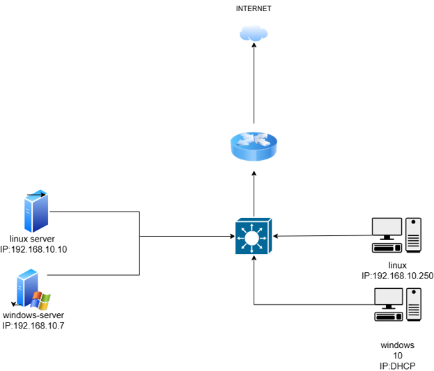
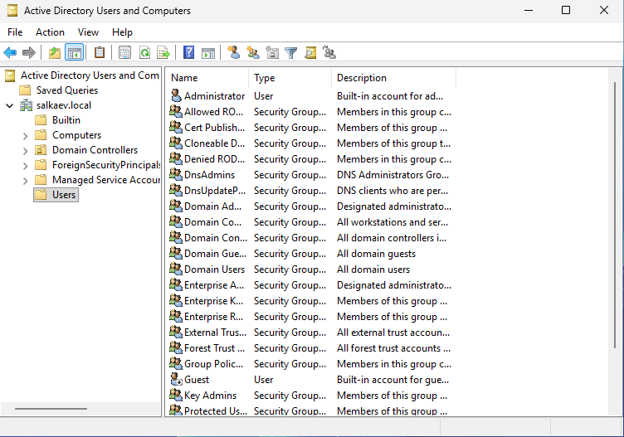
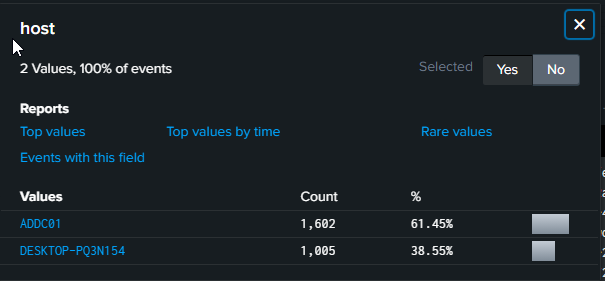

# Dual-SIEM Active Directory Detection Lab (Splunk & Elastic)

This project demonstrates a hybrid, enterprise-like security monitoring environment built for SOC analyst training, Windows security analysis, and cross-SIEM investigation practice. 

The unique feature of this laboratory is the **dual-engine telemetry collection**: it runs **Splunk Enterprise** and the **Elastic Stack (ELK)** in parallel. This allows for side-by-side comparison of attack detection using both **SPL** and **KQL** query languages within the same Active Directory infrastructure.

The goal of this laboratory is to simulate a corporate Windows infrastructure, collect security telemetry through different modern forwarders, analyze events, and prepare a solid foundation for detecting common adversary techniques.

# Lab Architecture

The environment consists of three virtual machines, with the monitoring infrastructure containerized to optimize resource allocation:

- **Windows Server**
  - Active Directory Domain Services (AD DS) / Domain Controller
  - DNS Server
  - User and domain management
  - Telemetry Shippers: Splunk Universal Forwarder & Elastic Winlogbeat

- **Windows 10 Workstation**
  - Domain-joined endpoint
  - Generates security events, user activity, and simulated attacks

- **Ubuntu Server (Central Management & SIEM Host)**
  - **Splunk Enterprise SIEM** (Native deployment for log indexing and SPL analysis)
  - **Elastic Stack (ELK)** (Containerized via Docker Compose: Elasticsearch & Kibana for KQL analysis)

## Architecture Diagram



# Active Directory Environment

The Windows Server was configured as an Active Directory Domain Controller. 

Implemented:
- Active Directory Domain Services (AD DS)
- DNS and domain environment setup
- Automated enterprise-like user structure generation
- Domain workstation integration

The Windows 10 machine was joined to the domain and used as an endpoint for generating both benign security events and malicious activity.



# Dual-SIEM & Log Collection Infrastructure

Windows hosts send telemetry simultaneously to two independent analytics platforms, simulating a multi-vendor corporate environment:

1. **Splunk Pipeline:** Windows hosts utilize the **Splunk Universal Forwarder** to stream logs natively to Splunk Enterprise.
2. **Elastic Pipeline:** Windows hosts utilize **Elastic Winlogbeat** to ship logs via HTTP directly into containerized Elasticsearch.

Collected telemetry across both platforms:
- Windows Security Event Log (Authentication, process creation, etc.)
- Windows System Event Log
- Windows Application Event Log
- Microsoft-Windows-Sysmon/Operational (Deep endpoint visibility)



# Log Analysis & Detection Engineering

The laboratory is used to practice and compare analytical workflows:
- **Windows Event Investigation:** Analyzing telemetry from both Kibana and Splunk dashboards.
- **Cross-Query Engineering:** Translating logic between **SPL** (Splunk Processing Language) and **KQL** (Kibana Query Language).
- **Process Execution Monitoring:** Tracking malicious behavior using Sysmon Event IDs (e.g., Event ID 1 for Process Creation).

### Example Telemetry Workflow:

       Security Event / Adversary Action
                       |
         +-------------+-------------+
         |                           |
         v                           v
Splunk Universal Forwarder     Elastic Winlogbeat
         |                           |
         v                           v
  Splunk Search (SPL)          Kibana Discover (KQL)
         |                           |
         +-------------+-------------+
                       |
                       v
            Incident Investigation
                       |
                       v
           Cross-SIEM Detection Rule

```

# Security Use Cases

Planned detection scenarios and threat hunting use cases:

## Active Directory Attacks

* Kerberoasting & AS-REP Roasting
* DCSync attacks
* Pass-the-Hash (PtH)
* Golden Ticket persistence

## Endpoint Attacks

* Suspicious PowerShell/CMD execution
* LOLBin abuse (Living off the Land Binaries)
* LSASS credential dumping (Credential Access)
* Persistence techniques (Registry modifications, scheduled tasks)

## Network Investigation

* Suspicious outbound connections
* DNS anomalies and beaconing detection
* Lateral movement tracking

# Tools & Technologies

| Category | Tools / Technologies |
| --- | --- |
| **SIEM Platforms** | Splunk Enterprise, Elasticsearch, Kibana |
| **Log Shippers** | Splunk Universal Forwarder, Elastic Winlogbeat |
| **Endpoint Monitoring** | Microsoft Sysmon |
| **Infrastructure & Virtualization** | Docker, Docker Compose, VirtualBox / VMware |
| **Operating Systems** | Windows Server, Windows 10, Ubuntu Server |
| **Directory Services** | Active Directory (AD DS) |
| **Query Languages** | SPL (Splunk), KQL (Kibana Query Language) |

# Skills Practiced

* **Multi-SIEM Administration:** Deploying and configuring both Splunk and Elastic (ELK) infrastructure.
* **Containerization:** Running security tools using Docker and Docker Compose.
* **Windows Security Monitoring:** Advanced understanding of Windows Event IDs and Sysmon behavior.
* **Detection Engineering:** Creating signature-based detection logic using two different query standards.
* **SOC Analyst Methodology:** Simulating corporate attacks and building incident investigation timelines.

# Future Improvements

* Map all simulated attacks to the **MITRE ATT&CK** framework.
* Integrate **Sigma rules** to auto-translate detection logic between Splunk and Elastic formats.
* Set up automated attack simulation scripts (e.g., Atomic Red Team).
* Create incident investigation report templates.

```