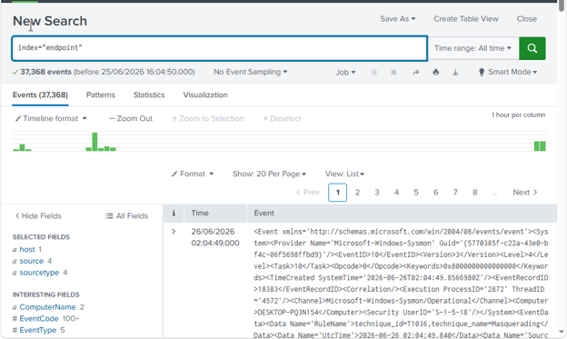

# Active Directory & Splunk SOC Detection Lab

This project demonstrates a small enterprise-like security monitoring environment built for SOC analyst training, Windows security analysis, and SIEM investigation practice.

The goal of this laboratory is to simulate a corporate Windows infrastructure, collect security telemetry, analyze events, and prepare a foundation for detecting and investigating common attack techniques.

# Lab Architecture

The environment consists of three virtual machines:

- **Windows Server**
  - Active Directory Domain Services (AD DS)
  - Domain Controller
  - DNS Server
  - User and domain management

- **Windows 10 Workstation**
  - Domain-joined endpoint
  - Generates security events and user activity

- **Ubuntu Server**
  - Splunk Enterprise SIEM
  - Centralized log collection and analysis

## Architecture Diagram

# Active Directory Environment

The Windows Server was configured as an Active Directory Domain Controller.

Implemented:

- Active Directory Domain Services
- DNS
- Domain environment
- User management
- Domain workstation integration

The Windows 10 machine was joined to the domain and used as an endpoint for generating security events.

# SIEM Deployment

Splunk Enterprise was deployed on an Ubuntu Server.

Windows hosts send logs using **Splunk Universal Forwarder**.

Collected telemetry:

- Windows Security Event Log
- Windows System Event Log
- Windows Application Event Log
- Microsoft-Windows-Sysmon/Operational

# Log Analysis

The laboratory is used to practice:

- Windows event investigation
- Authentication analysis
- Process execution monitoring
- Detection rule development
- SPL query creation

Example workflow:
Security Event
        |
        v
Splunk Search
        |
        v
Investigation
        |
        v
Detection / Response

# Security Use Cases

Planned detection scenarios:

## Active Directory Attacks

- Kerberoasting
- AS-REP Roasting
- DCSync
- Pass-the-Hash
- Golden Ticket

## Endpoint Attacks

- Suspicious PowerShell execution
- LOLBin abuse
- LSASS credential dumping
- Persistence techniques

## Network Investigation

- Suspicious connections
- DNS anomalies
- Lateral movement detection

# Tools & Technologies

| Category | Tools |
|-|-|
| SIEM | Splunk Enterprise |
| Log Collection | Splunk Universal Forwarder |
| Endpoint Monitoring | Sysmon |
| Operating Systems | Windows Server, Windows 10, Ubuntu |
| Directory Services | Active Directory |
| Query Language | SPL |

# Skills Practiced

- Windows security monitoring
- Active Directory administration
- SIEM deployment
- Log analysis
- Incident investigation workflow
- Detection engineering fundamentals
- SOC analyst methodology

# Future Improvements

- Add custom SPL detection rules
- Simulate MITRE ATT&CK techniques
- Create incident investigation reports
- Integrate network monitoring tools
- Develop threat hunting scenarios