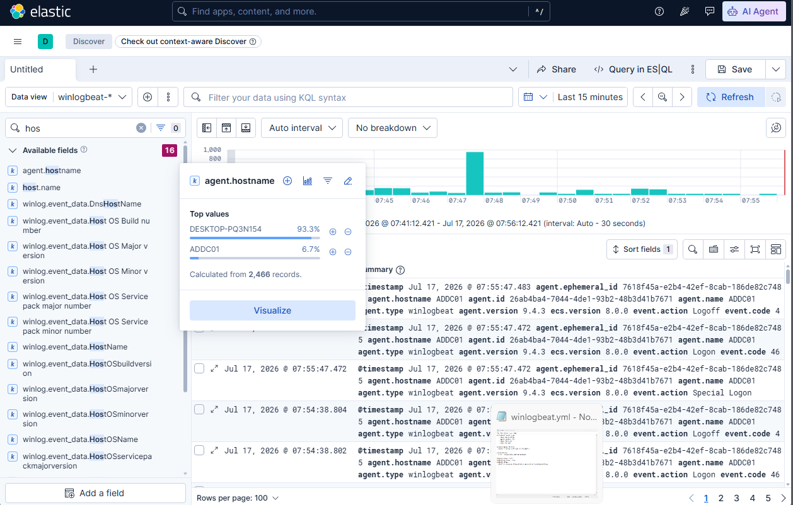

# Active Directory Detection Lab (Elastic Security)

This project demonstrates an enterprise-like security monitoring environment built for SOC analyst training, Windows security analysis, and detection engineering practice using the Elastic Stack. 

The core feature of this laboratory is the implementation of a centralized telemetry collection pipeline that feeds into **Elastic Security (SIEM)**. This setup allows for hands-on experience in threat hunting and writing detection rules using the **ES|QL** and **KQL** query languages within a real Active Directory infrastructure.

The goal of this laboratory is to simulate a corporate Windows infrastructure, collect security telemetry through modern forwarders, analyze events, and prepare a solid foundation for detecting common adversary techniques.

# Lab Architecture

The environment consists of three virtual machines, with the monitoring infrastructure containerized to optimize resource allocation:

- **Windows Server**
  - Active Directory Domain Services (AD DS) / Domain Controller
  - DNS Server
  - User and domain management
  - Telemetry Shipper: Elastic Winlogbeat

- **Windows 10 Workstation**
  - Domain-joined endpoint
  - Generates security events, user activity, and simulated attacks

- **Ubuntu Server (Central Management & SIEM Host)**
  - **Elastic Stack (ELK)** (Containerized via Docker Compose: Elasticsearch & Kibana for security analysis and alerting)

## Architecture Diagram


# Active Directory Environment

The Windows Server was configured as an Active Directory Domain Controller. 

Implemented:
- Active Directory Domain Services (AD DS)
- DNS and domain environment setup
- Automated enterprise-like user structure generation
- Domain workstation integration

The Windows 10 machine was joined to the domain and used as an endpoint for generating both benign security events and malicious activity.


# SIEM & Log Collection Infrastructure

Windows hosts send telemetry to a centralized analytics platform, simulating a modern corporate security architecture. Windows hosts utilize **Elastic Winlogbeat** to ship logs via HTTP directly into containerized Elasticsearch.

Collected telemetry across the platform:
- Windows Security Event Log (Authentication, process creation, etc.)
- Windows System Event Log
- Windows Application Event Log
- Microsoft-Windows-Sysmon/Operational (Deep endpoint visibility)



# Log Analysis & Detection Engineering

The laboratory is used to practice and validate analytical workflows:
- **Windows Event Investigation:** Analyzing telemetry using Kibana dashboards and Discover.
- **Detection Engineering:** Creating advanced detection logic using **ES|QL** (Elasticsearch Query Language) and **KQL** (Kibana Query Language).
- **Process Execution Monitoring:** Tracking malicious behavior using Sysmon Event IDs (e.g., Event ID 1 for Process Creation).

### Example Telemetry Workflow:

```mermaid
flowchart TD
    Event[Adversary Action / Security Event] --> EWB[Elastic Winlogbeat]
    EWB --> Kibana[Elasticsearch & Kibana / ES|QL & KQL]
    Kibana --> Inv[Incident Investigation & Triage]
    Inv --> Rule[Elastic Security Detection Rule / Alert]

    style Event fill:#ffe8cc,stroke:#f08c00,stroke-width:2px
    style Rule fill:#d0ebff,stroke:#228be6,stroke-width:2px